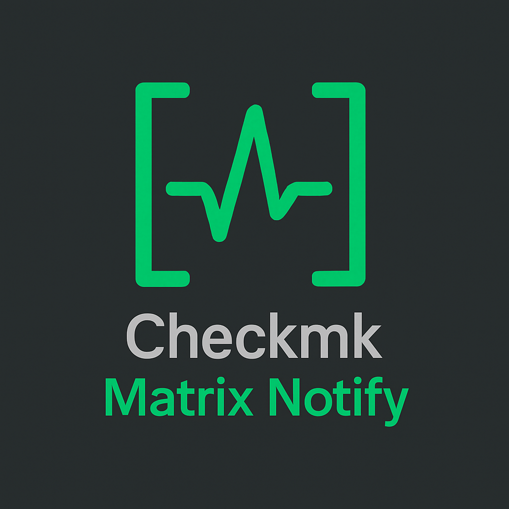
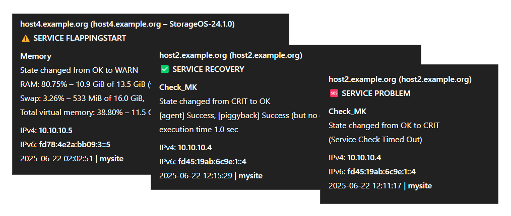
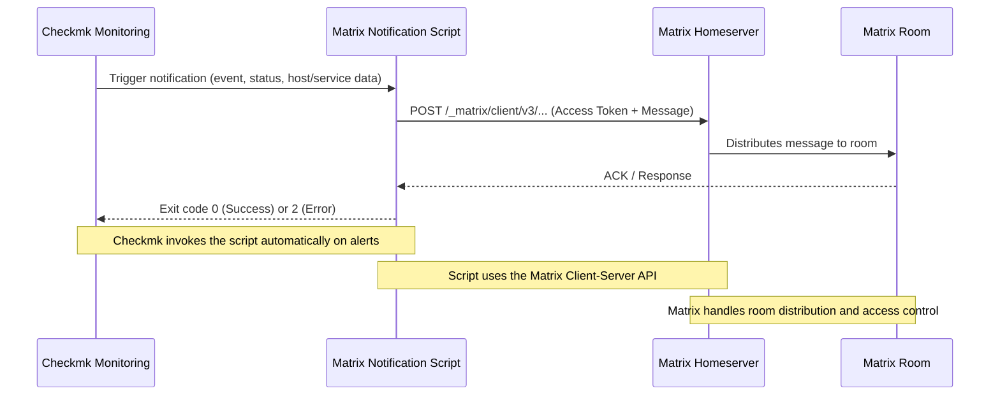
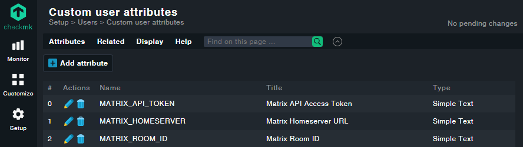
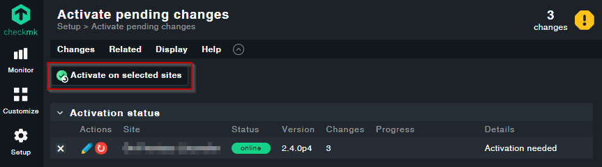

This repository provides a shell script for sending notifications from Checkmk to a Matrix room using the Matrix Client-Server API. It supports configuration via custom user attributes and fallback parameters, making it suitable for flexible and secure integration into your monitoring environment.

<!-- TOC -->

- [EXAMPLE](#example)
- [HOW IT WORKS](#how-it-works)
- [REQUIREMENTS](#requirements)
- [MATRIX BOT USER & API TOKEN](#matrix-bot-user--api-token)
- [INSTALLATION](#installation)
- [UPDATE EXISTING INSTALLATION](#update-existing-installation)
- [CHECKMK CONFIGURATION](#checkmk-configuration)
  - [CUSTOM USER ATTRIBUTES](#custom-user-attributes)
  - [ACTIVATE CHANGES](#activate-changes)
  - [TEST NOTIFICATIONS](#test-notifications)
- [HELP & TROUBLESHOOTING GUIDE](#help--troubleshooting-guide)
- [DISCLAIMER](#disclaimer)
- [CONTRIBUTIONS](#contributions)
- [LICENSE](#license)

<!-- /TOC -->

This plugin has been tested and confirmed to be compatible with Checkmk RAW version 2.4.0
(RedHat/CentOS/AlmaLinux/RockyLinux 8 and 9). It is expected to work with other versions of Checkmk as well.

## EXAMPLE

Notifications are typically sent to a Matrix room. Below is an example of how a Matrix notification might look.



## HOW IT WORKS



## REQUIREMENTS

To enable Checkmk to send notifications via Matrix, you need the following:

- A running Matrix Synapse server (or compatible Matrix homeserver)
- A working Checkmk instance (RAW edition or compatible)
- A Matrix account (bot user) on your Synapse server
- The Matrix user ID, password and API token for the bot
- The Matrix homeserver URL (e.g., `https://matrix.example.com`)
- The Matrix room ID or alias where notifications should be sent

Make sure both your Matrix server and Checkmk instance are properly installed and accessible before proceeding with the integration.

## MATRIX BOT USER & API TOKEN

To send notifications via Matrix, you need a dedicated bot user and an API token. The process of creating a Matrix user and generating an API token is described in detail in the [USER_AND_TOKEN_SETUP.md](USER_AND_TOKEN_SETUP.md) file.

Once you have completed these steps, you can use the credentials and token as described in the installation and configuration sections above.

## INSTALLATION

Switch to the Checkmk site user to ensure proper permissions for the following commands:

```
su - {sitename}
```

Navigate to the notification directory where custom notification scripts are stored:

```
cd ~/local/share/check_mk/notifications/
```

Download the Matrix notify script from the Git repository (a new subfolder will be created to store the notification script and its related files):

```
git clone https://github.com/filipnet/checkmk-matrix-notify.git
```

Give the script execution permissions:

```
chmod +x checkmk-matrix-notify/check_mk_matrix-notify.sh
```

Verify that the script has the correct permissions:

```
ls -l checkmk-matrix-notify/check_mk_matrix-notify.sh
```

Create a symbolic link to enable the plugin and integrate the notification script into the Checkmk system:

```
ln -s checkmk-matrix-notify/check_mk_matrix-notify.sh check_mk_matrix-notify.sh
```

## UPDATE EXISTING INSTALLATION

To update an existing installation of the Checkmk Matrix notification script, run:

```
su - {sitename}
cd ~/local/share/check_mk/notifications/checkmk-matrix-notify
git pull
```

## CHECKMK CONFIGURATION

You can now create your own notification rules in Checkmk to define how and when notifications are sent to Matrix.

To configure notifications, go to the main menu in Checkmk, select `Setup → Events → Notifications`:

- Clone your existing mail notification rule.
- Change the description (e.g. Notify all contacts of a host/service via Matrix)
- Set the notification method to "Push Notification (by Matrix)"

> ⚠️ Using **"Call with the following parameters:"** is technically possible but no longer considered best practice.
> Instead, use **Custom user attributes** to provide values like the Matrix homeserver, access token, and room ID – this is cleaner, more maintainable, and integrates better with user or rule-based configurations.

### CUSTOM USER ATTRIBUTES

You can add a custom user attribute for Matrix homeserver, room ID and API token. This allows you to send notifications to different Matrix rooms or users based on the Checkmk user profile.

- Go to: `Setup > Users > Custom User Attributes`

| CheckMK Attribute Name | Matrix Variable Description | Available in Script as             |
| ---------------------- | --------------------------- | ---------------------------------- |
| `MATRIX_ROOM_ID`       | Matrix Room ID              | `NOTIFY_CONTACT_MATRIX_ROOM_ID`    |
| `MATRIX_HOMESERVER`    | Matrix Homeserver URL       | `NOTIFY_CONTACT_MATRIX_HOMESERVER` |
| `MATRIX_API_TOKEN`     | Matrix API Access Token     | `NOTIFY_CONTACT_MATRIX_API_TOKEN`  |

- **Do NOT change the name**: The notification script and Checkmk configuration specifically look for specific attribute names. If you use a different name, notifications will not work
- You can change the title and help text
- You can freely change the topic; the attribute is added to this section in the edit dialog, e.g. from Personal settings to Notification.
- Make sure you activate the option `Make this variable available in notifications`



### ACTIVATE CHANGES

To activate the changes, press "Active on selected sites":



Optional: Restart the Checkmk instance to ensure all configuration changes are applied:

```
su - {sitename}
omd stop
omd start
```

### TEST NOTIFICATIONS

You can test notifications using the **Test Notifications** feature as explained in the Checkmk documentation: for the option _“Trigger notification for a specific method”_, refer to the official guide [here](https://docs.checkmk.com/latest/en/intro_notifications.html#switching-on-notifications).

> ⚠️ **Note:** The "Test Notifications" feature in Checkmk only simulates rule matching and recipients. It does not send actual messages, and custom user attributes may not be available.

For a complete end‑to‑end test of your scripts and custom attributes, it’s best to use a dedicated test server or an uncritical end device.

_(Source: [Checkmk Documentation](https://docs.checkmk.com/latest/en/intro_notifications.html#switching-on-notifications))_

## HELP & TROUBLESHOOTING GUIDE

For advanced usage and troubleshooting, see the [HELP & TROUBLESHOOTING GUIDE](HELP.md).

## DISCLAIMER

This project is community-driven and not officially associated with tribe29 GmbH, the makers of Checkmk. It is provided independently to extend Checkmk with Matrix notifications. Special thanks to the Checkmk team for providing a powerful and extensible monitoring platform.

## CONTRIBUTIONS

Contributions are welcome! If you would like to improve this project, please feel free to submit a pull request. All contributions, bug reports, and feature suggestions are appreciated.

## LICENSE

checkmk-matrix-notify and all individual scripts are under the BSD 3-Clause license unless explicitly noted otherwise. See the [LICENSE](LICENSE) file for more details.
