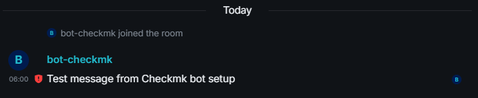

# USER AND TOKEN SETUP

<!-- TOC -->

- [USER AND TOKEN SETUP](#user-and-token-setup)
  - [CREATE MATRIX BOT USER](#create-matrix-bot-user)
  - [CREATE NEW USER ACCOUNT](#create-new-user-account)
  - [VERIFY THAT UER HAS BEEN CREATED](#verify-that-uer-has-been-created)
  - [OPTAIN AN API ACCESS TOKEN](#optain-an-api-access-token)
    - [OPTION A: USING MATRIX CLIENT (MANUAL METHOD)](#option-a-using-matrix-client-manual-method)
    - [OPTION B: USING ADMIN API (SYNAPSE ADMIN COMMAND LINE)](#option-b-using-admin-api-synapse-admin-command-line)
  - [SECURITY NOTICE](#security-notice)
  - [HOW TO FIND THE MATRIX ROOM-ID](#how-to-find-the-matrix-room-id)
    - [OPTION A: USING ELEMENT (WEB/DESKTOP CLIENT)](#option-a-using-element-webdesktop-client)
    - [OPTION B: USING THE MATRIX API](#option-b-using-the-matrix-api)
    - [OPTION C: USING MATRIX CLIENT-SERVER API (IF YOU ARE MEMBER OF THE ROOM)](#option-c-using-matrix-client-server-api-if-you-are-member-of-the-room)
  - [TESTING BOT USER FROM COMMAND LINE (DRY RUN)](#testing-bot-user-from-command-line-dry-run)

<!-- /TOC -->

## CREATE MATRIX BOT USER

For details on creating a Matrix bot user, refer to the [official Synapse documentation](https://matrix-org.github.io/synapse/latest/usage/administration/users.html).

To enable Checkmk to send alerts via Matrix, it is recommended to create a dedicated service user. This improves security, traceability, and separation of responsibilities.

## CREATE NEW USER ACCOUNT

Use the server's registration method (e.g. `register_new_matrix_user` via Synapse or an admin web UI).

Example command (Synapse, non-admin user):

```bash
cd /opt/synapse/venv/bin/
./register_new_matrix_user -c /opt/synapse/homeserver.yaml -u bot-checkmk -p 'ExampleOnly!DoNotUse123' --no-admin http://localhost:8008
```

- `-u bot-checkmk`: Specifies the username for the dedicated Checkmk service user.
- `-p 'ExampleOnly!DoNotUse123'`: Sets the password for the new user (use a strong, unique password in production).
- `--no-admin`: Ensures the user is created without admin rights (recommended for bots).
- `http://localhost:8008`: URL of your Synapse homeserver.

## VERIFY THAT UER HAS BEEN CREATED

After running the registration command, you should see a confirmation message such as:

```
Sending registration request...
Success!
```

This indicates that the Matrix bot user was created successfully. If you encounter an error, review the command syntax and ensure you have the necessary permissions.

## OPTAIN AN API ACCESS TOKEN

There are two common ways to obtain an access token for your Matrix bot user:

### OPTION A: USING MATRIX CLIENT (MANUAL METHOD)

- Log in with the bot user in your preferred Matrix client.
- Inspect the login response or use developer tools to extract the `access_token`.
- Alternatively, check the homeserver logs for the token.

Example access token:

```
ABCDEFG1234567890fakeTokenOnlyForDocs
```

Store this token securely. You will need it in your Checkmk notification script or integration.

### OPTION B: USING ADMIN API (SYNAPSE ADMIN COMMAND LINE)

Get an API token for the new user:

```bash
curl -X POST 'https://matrix.example.org/_matrix/client/r0/login' \
  -H 'Content-Type: application/json' \
  -d '{
      "type": "m.login.password",
      "user": "bot-checkmk",
      "password": "ExampleOnly!DoNotUse123"
      }'
```

The response will include an `access_token`:

```json
{
  "user_id": "@bot-checkmk:matrix.example.org",
  "access_token": "ABCDEFG1234567890fakeTokenOnlyForDocs",
  "home_server": "matrix.example.org",
  "device_id": "AGZLXFAZTST"
}
```

Store the `access_token` securely. This token is used to authenticate API requests on behalf of the user.

## SECURITY NOTICE

> ⚠️ **Security Notice**
>
> - Do not use the example password in production:
> - ExampleOnly!DoNotUse123 is not safe and is only intended as a placeholder.
> - Always use a unique, randomly generated password for real-world usage.
> - Prefer generating a bot token (access token) and restrict its permissions to the minimum required (read/send messages only).
> - Rotate bot tokens and passwords regularly, and immediately if you suspect compromise.
> - Monitor bot activity and access logs for signs of misuse or unauthorized access.
> - Never expose tokens or credentials in public repositories.

## HOW TO FIND THE MATRIX ROOM-ID

There are several ways to find the room ID (it looks like `!abcdefg12345:matrix.example.org`):

### OPTION A: USING ELEMENT (WEB/DESKTOP CLIENT)

- Open the room in Element.
- Click on the room name at the top to open room settings.
- Scroll down to the "Advanced" section.
- The "Internal room ID" is shown there. Copy it (it starts with `!`).

### OPTION B: USING THE MATRIX API

If you know the room alias (e.g., `#myroom:matrix.example.org`), you can resolve it to a room ID with the following API call:

```bash
curl -X GET 'https://matrix.example.org/_matrix/client/r0/directory/room/%23myroom%3Amatrix.example.org'
```

- Replace `%23myroom%3Amatrix.example.org` with your room alias, URL-encoded (`#` becomes `%23`, `:` becomes `%3A`).
- The response will include a `room_id` field.

### OPTION C: USING MATRIX CLIENT-SERVER API (IF YOU ARE MEMBER OF THE ROOM)

List joined rooms:

```bash
curl -X GET 'https://matrix.example.org/_matrix/client/r0/joined_rooms' \
  -H 'Authorization: Bearer YOUR_ACCESS_TOKEN'
```

- The response will list all room IDs you have joined.

## TESTING BOT USER FROM COMMAND LINE (DRY RUN)

To verify that your Matrix bot user and access token work, you can send a test message directly from the command line using `curl`—no custom scripts required.

Replace the placeholders with your actual values:

```bash
curl -X POST 'https://matrix.example.org/_matrix/client/r0/rooms/!yourRoomId:matrix.example.org/send/m.room.message' \
  -H 'Authorization: Bearer YOUR_ACCESS_TOKEN' \
  -H 'Content-Type: application/json' \
  -d '{
        "msgtype":"m.text",
        "body":"Test message from Checkmk bot setup"
      }'
```

- `YOUR_ACCESS_TOKEN`: The token you obtained for the bot user.
- `!yourRoomId:matrix.example.org`: The Matrix room ID (not the alias) where you want to send the message.

If successful, you will receive a JSON response with an `event_id`. Check your Matrix client to confirm the message was delivered.

```
{"event_id":"$EjivFu4L36lFvN95N5yBNi7TtRLtCiwlV1gBJClJEAo"}
```


